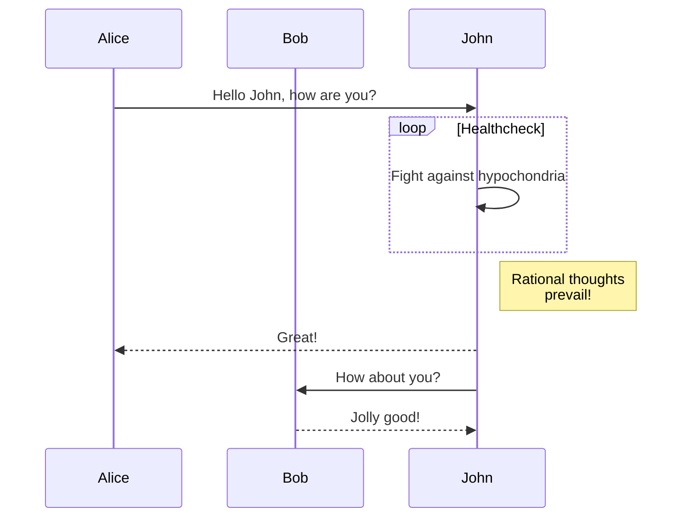

# Apple生态下的开源笔记 - FSNotes

## 介绍
FSNote是一款支持 macOS 和 iOS 的开源笔记软件。
官方列出了以下主要特点
> Markdown 优先，支持纯文本和 RTF 文件
> 轻量流畅，10k+文件仍然运行良好
> iCloud Drive 或 Dropbox 同步（任何同步盘）
> 多文件夹存储
> 操作以键盘为中心，快捷键启发自nvALT
> 自适应双窗格视图，可选垂直或水平排布
> 外部编辑器支持，无缝实时同步
> 支持超过 170 种编程语言的代码高亮
> 支持行内图像
> 支持标签
> 支持笔记跳转 [[双方括号]]
> 支持固定笔记
> 支持笔记快捷复制到剪贴板
> 黑暗模式
> AES-256 加密
> 支持 Mermaid 与 MathJax
> 可选的 Git 版本控制和备份


软件大小仅 13.5 MB，但功能齐全。
macOS 版完全免费，但提供 Mac App Store 付费下载，用于支持作者开发
iOS 版付费买断，国区售价¥18。可以选择使用云服务同步到 iOS 后使用其他支持 Markdown 的软件进行编辑查看。

## 安装
macOS端可以使用 Homebrew 进行安装
```
brew install fsnotes
```
或在 GitHub Releases 界面下载
 [GitHub Releases](https://github.com/glushchenko/fsnotes/releases) 

## 使用
完成安装后，软件内置非常详细的英文使用教学。

笔者对其进行了翻译，并且在 GitHub 提交了希望增加多语言支持的 Issues。


接下来是本人翻译的使用教学。

### 1. 引言

嗨，我的名字是 Oleksandr，我是这个程序的作者。几年前，我发现我最喜欢的笔记应用 nvALT 不再启动了。

现有的 macOS 和 iOS 替代方案都不适合我，因为我已经当了很多年开发者，所以我尝试编写自己的解决方案。2017年夏天，我在 GitHub 上公布了 FSNotes 的源代码。这是一个糟糕的应用程序。很烂，功能也差。但我没有放弃，贡献者们也没有。

现在，FSNotes 已被翻译成 12 种语言，使用者遍布全球。功能数量超过一百个，其中还有几十个是独有的。

如果您喜欢此应用程序，请支持开发。在App Store购买 [Mac App Store](https://apps.apple.com/app/fsnotes/id1277179284) 以及在 [AppStore](https://apps.apple.com/app/fsnotes-manager/id1346501102) 获得移动版本的FSNotes。

谨致问候，
FSNotes 开发者，Oleksandr Hlushchenko
邮件: support@fsnot.es

### 2. 链接

[[1. 引言]]
[[2. 链接]]
[[3. 快捷键]]
[[4. 侧边栏]]
[[5. 标签和子标签]]
[[6. Mermaid 与 MathJax]]
[[7. 基于 Git 的版本控制]]
[[8. 容器]]
[[9. GitHub Flavored Markdown]]
注：以上内容只能在 FSNotes 软件中点击跳转

官方网站：https://fsnot.es
Issues：https://github.com/glushchenko/fsnotes/issues
Wiki：https://github.com/glushchenko/fsnotes/wiki
公告：https://twitter.com/fsnotesapp

### 3. 快捷键

FSNotes 支持纯键盘操作，是一款快捷键友好的应用。

您必须学会的最重要的组合键是：

`cmd - backtick` - 用 CMD+反单引号 (TAB上面那个) 禁用/启用预览模式。

替代方案: 您可以也可以通过菜单栏中的**视图-切换预览**来完成以上操作 `View - Toggle Preview`

#### 全局

- `cmd + option + shift + L` - 打开主窗口并聚焦搜索栏
- `cmd + option + shift + n` - 保存剪贴板
- `enter` - 向右移动文件夹层级（向下）; 侧边栏 > 笔记列表 > 笔记
- `cmd + enter` - 向左移动文件夹层级（向上）; 笔记 > 笔记列表 > 侧边栏

#### 搜索栏

- `down arrow` - 用下箭头将焦点移到笔记列表上
- `enter` - 回车新建笔记

#### 主窗口

- `esc` - 将光标移到搜索栏并清屏（不删除编辑内容）
- `cmd + L` - 聚焦搜索栏
- `tab` - TAB转到下一区域
- `cmd + backtick` - CMD+反单引号 预览模式（仅限 Markdown）
- `up, down arrows` - 下箭头选择笔记
- `cmd + j` - 下一篇笔记
- `cmd + k` - 上一篇笔记

#### 笔记列表

- `cmd + delete` - 删除笔记
- `cmd + r` - 重命名笔记
- `cmd + 8` - 固定笔记
- `cmd + 7` - 去除加密（解密之前加密的笔记）
- `cmd + n` - 新建笔记
- `cmd + shift + n` - 新建 RTF
- `ctrl + cmd + e` – 在外部编辑器中打开所选内容
- `ctrl + cmd + o` – 在 Finder 中显示所选内容
- `shift + cmd + m` – 在存储中移动所选笔记
- `shift + cmd + b` – 隐藏侧边栏
- `cmd + s` – 将修订版本保存在 Git 中
- `cmd + d` – 创建笔记副本
- `cmd + alt + l` - 加密/解密笔记（AES 256）

#### 编辑

- `fn + f5` - 自动完成笔记名称
- ``cmd + ` ``，或点击 `View - Toggle preview` - 用于启用或禁用markdown预览

### 4. 侧边栏

要切换项目和标签侧边栏按钮 `control + cmd + shift + b`

您可以选择和过滤无限制的项目和标签。

#### 每个子文件夹都是一个项目

在您的存储空间中创建无限制的文件夹。右键单击根文目录(`Documents`) 并单击“新建文件夹” `⌥ option + ⇧ shift + n`.

每个项目都有自己的设置，右键单击项目 - "显示视图选项" `cmd + shift + ,`.


您可以配置排序、方向、可见性设置。


### 5. 标签和子标签

FSNotes version 4 带来了一个令人惊叹的行内标签系统。只需在文字前面加上井号 (#)即可为笔记添加标签。像这样： #hello 。或者，像这样为它们添加子标签： #hello/world 。您能给您的笔记贴多厚的标签？像 #unlimited/sub/tags 。标签会自动完成。输入井号 (#)和标签的第一个字符，然后：


很好！还有别的。每个项目都有自己的标签命名空间。例如，选择“存档”时，仅显示“存档”的笔记中的标签。

在侧边栏选择的同时按住`cmd`可以多选多个项目和标签。


### 6. Mermaid 与 MathJax

#### Mermaid 流程图示例

支持文档：https://mermaidjs.github.io



#### MathJax 数学公式示例

支持文档：https://www.mathjax.org

> 请启用菜单栏中的：视图 > Preview MathJax

当 (($a \ne 0$))，有两种解法可用于 $$ax^2 + bx + c = 0$$ 它们是
$$x = {-b \pm \sqrt{b^2-4ac} \over 2a}.$$

### 7. 基于 Git 的版本控制

使用 `cmd + s` 快捷键来保存笔记：


并在菜单栏恢复到历史版本：


#### 自动备份所有笔记

在偏好设置中配置：


例如，每小时进行一次备份。

#### 您还可以备份备份 🤪

毕竟再安全也不为过。


### 8. 容器

什么是容器？“容器”是存放您的文件的文件夹。容器保存一个笔记中使用的文本和其他资源。当然，您可以选择不使用容器。打开偏好设置-> 基本-> 容器并选择“无”。笔记将以纯文本、 Markdown 或 RTF 格式存储。

我建议对敏感数据使用 TextBundle 容器和加密 TextBundle 容器。请继续阅读

#### TextBundle 容器

文件扩展名 – `.textbundle`

TextBundle – 这种格式旨在在应用程序之间交换纯文本文件(如 Markdown 或 RTF)时提供更无缝的用户体验。 http://textbundle.org

例如，一个 Markdown 文件可能包含对外部图像的引用。当从 Markdown 编辑器发送这样的文件到预览器时，用户必须明确指定每一个图像文件的位置。这就是 TextBundle 派上用场的地方。通过将 Markdown 文本和所有引用的图像打包在一个文件中，Text Bundle 提供更方便的体验。

#### 加密 TextBundle 容器

文件扩展名 – `.etp`.

加密文本包用于笔记加密。它是加密的文本包（压缩包）并用 RNCryptor 加密。RNCryptor 是一种跨平台的数据格式，有很多实现方案。在软件后台，我们有：

AES-256 加密
CBC 模式
PBKDF2 密码延伸
密码加盐
随机 IV
加密后哈希 HMAC
开放和跨平台

您可以使用 Python 或 Ruby、JS 等解密任何 FSNotes 笔记(完整列表可在此处找到)
解压缩并用普通的文本格式快活吧。

### 9. GitHub Flavored Markdown

#### 标题 h1-h6

快捷键：`cmd + 1-6`

#### 图像


快捷键：`cmd + shift + i`

#### 粗体、斜体、删除线

**粗体**
快捷键：`cmd + b`

_斜体_
快捷键：`cmd + i`

~~删除线~~
快捷键：`cmd + y`

#### 引用 

> 您可以引用
> 不止一行

快捷键：`cmd + shift + u`

#### 代码块

Swift 示例：

```swift
public static func getHighlighter() -> Highlightr? {
    if let instance = self.hl {
        return instance
    }
    
    guard let highlightr = Highlightr() else {
        return nil
    }
    
    highlightr.setTheme(to: "vs")
    self.hl = highlightr
    
    return self.hl
}
```

SQL 示例：

```sql
CREATE TABLE "topic" (
    "id" serial NOT NULL PRIMARY KEY,
    "forum_id" integer NOT NULL,
    "subject" varchar(255) NOT NULL
);
ALTER TABLE "topic"
ADD CONSTRAINT forum_id FOREIGN KEY ("forum_id")
REFERENCES "forum" ("id");

-- Initials
insert into "topic" ("forum_id", "subject")
values (2, 'D''artagnian');
```

快捷键：`cmd + control + c`

#### Code span

`One line code span`

快捷键：`cmd + shift + c`

#### 列表、编号列表和待办事项

- 列表

快捷键：`control + L`

1. 第一项
2. 第二项

快捷键：`control + shift + L`

- [x] 付帐
- [ ] 买水

快捷键：`cmd + t`

#### Wiki 链接

添加 Wiki 链接 [[WikiLinks with emoji 😎]]

快捷键：`cmd + 9`

## 小结

以上是 FSNotes 的使用教程，这篇教程将 FSNotes 的常用使用场景基本表现了出来，作为一款以 Markdown 为主的笔记软件，其优缺点都十分明显。
对于已经有 Markdown 使用经验的朋友，应该已经有了一套自己管理`.md`文件的工作流。但对于新手，通过一个更加类似传统笔记软件（Evernote，OneNote）的笔记软件来熟悉 Markdown 的使用可以是个非常友好的入门选择。